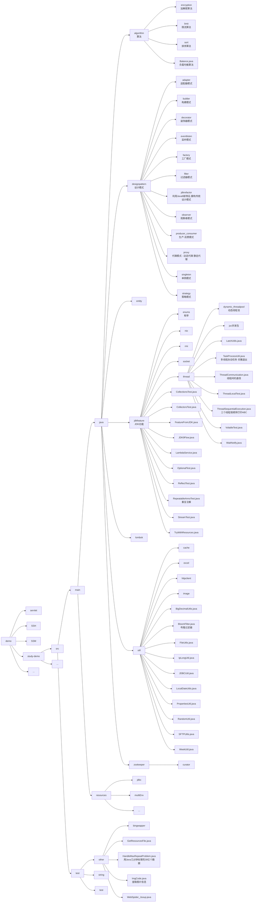

```mermaid

graph LR
    demo[demo] --> servlet[servlet]
    demo --> SSH[SSH]
    demo --> SSM[SSM]
    demo --> study-demo[study-demo]
    demo --> 其他[...]
    
    study-demo --> src[src]
    study-demo --> 其他1[...]
    
    src --> main[main]
    src --> test[test]
    
    main --> java[java]
    main --> resources[resources]
    
    java --> algorithm[algorithm<br/>算法]
    java --> designpattern[designpattern<br/>设计模式]
    java --> entity[entity]
    java --> jdkfeature[jdkfeature<br/>JDK功能]
    java --> lombok[lombok]
    java --> util[util]
    java --> zookeeper[zookeeper]
    
    algorithm --> encryption[encryption<br/>加解密算法]
    algorithm --> limit[limit<br/>限流算法]
    algorithm --> sort[sort<br/>排序算法]
    algorithm --> Balance.java[Balance.java<br/>负载均衡算法]
    
    designpattern --> adapter[adapter<br/>适配器模式]
    designpattern --> builder[builder<br/>构建模式]
    designpattern --> decorator[decorator<br/>装饰器模式]
    designpattern --> eventlisten[eventlisten<br/>监听模式]
    designpattern --> factory[factory<br/>工厂模式]
    designpattern --> filter[filter<br/>过滤器模式]
    designpattern --> jdkrefactor[jdkrefactor<br/>利用Java8新特征,重构传统设计模式]
    designpattern --> observer[observer<br/>观察者模式]
    designpattern --> producer_consumer[producer_consumer<br/>生产-消费模式]
    designpattern --> proxy[proxy<br/>代理模式 - 动态代理 静态代理]
    designpattern --> singleton[singleton<br/>单例模式]
    designpattern --> strategy[strategy<br/>策略模式]
    
    jdkfeature --> enums[enums<br/>枚举]
    jdkfeature --> nio[nio]
    jdkfeature --> rmi[rmi]
    jdkfeature --> socket[socket]
    jdkfeature --> thread[thread]
    jdkfeature --> CollectionsTest.java[CollectionsTest.java]
    jdkfeature --> CollectorsTest.java[CollectorsTest.java]
    jdkfeature --> FeatureFromJDK.java[FeatureFromJDK.java]
    jdkfeature --> JDK9Flow.java[JDK9Flow.java]
    jdkfeature --> LambdaService.java[LambdaService.java]
    jdkfeature --> OptionalTest.java[OptionalTest.java]
    jdkfeature --> ReflectTest.java[ReflectTest.java]
    jdkfeature --> RepeatableAnnoTest.java[RepeatableAnnoTest.java<br/>重复注解]
    jdkfeature --> StreamTest.java[StreamTest.java]
    jdkfeature --> TryWithResources.java[TryWithResources.java]
    
    thread --> dynamic_threadpool[dynamic_threadpool<br/>动态线程池]
    thread --> juc[juc并发包]
    thread --> LatchUtils.java[LatchUtils.java]
    thread --> TaskProcessUtil.java[TaskProcessUtil.java<br/>多线程永动任务 优雅退出]
    thread --> ThreadCommunication.java[ThreadCommunication.java<br/>线程间的通信]
    thread --> ThreadLocalTest.java[ThreadLocalTest.java]
    thread --> ThreadSequentialExecution.java[ThreadSequentialExecution.java<br/>三个线程按顺序打印ABC]
    thread --> VolatileTest.java[VolatileTest.java]
    thread --> WaitNotify.java[WaitNotify.java]
    
    util --> cache[cache]
    util --> excel[excel]
    util --> httpclient[httpclient]
    util --> image[image]
    util --> BigDecimalUtils.java[BigDecimalUtils.java]
    util --> BloomFilter.java[BloomFilter.java<br/>布隆过滤器]
    util --> FileUtils.java[FileUtils.java]
    util --> IpLongUtil.java[IpLongUtil.java]
    util --> JDBCUtil.java[JDBCUtil.java]
    util --> LocalDateUtils.java[LocalDateUtils.java]
    util --> PropertiesUtil.java[PropertiesUtil.java]
    util --> RandomUtil.java[RandomUtil.java]
    util --> SFTPUtils.java[SFTPUtils.java]
    util --> WeekUtil.java[WeekUtil.java]
    
    zookeeper --> curator[curator]
    
    resources --> jdbc[jdbc]
    resources --> multiEnv[multiEnv]
    resources --> 其他2[...]
    
    test --> other[other]
    test --> string[string]
    test --> test1[test]
    
    other --> bingwapper[bingwapper]
    other --> GetResourcesFile.java[GetResourcesFile.java]
    other --> HandleMaxRepeatProblem.java[HandleMaxRepeatProblem.java<br/>用Java几分钟处理完30亿个数据]
    other --> ImgCode.java[ImgCode.java<br/>提取图片信息]
    other --> WebSpider_Jsoup.java[WebSpider_Jsoup.java]

```